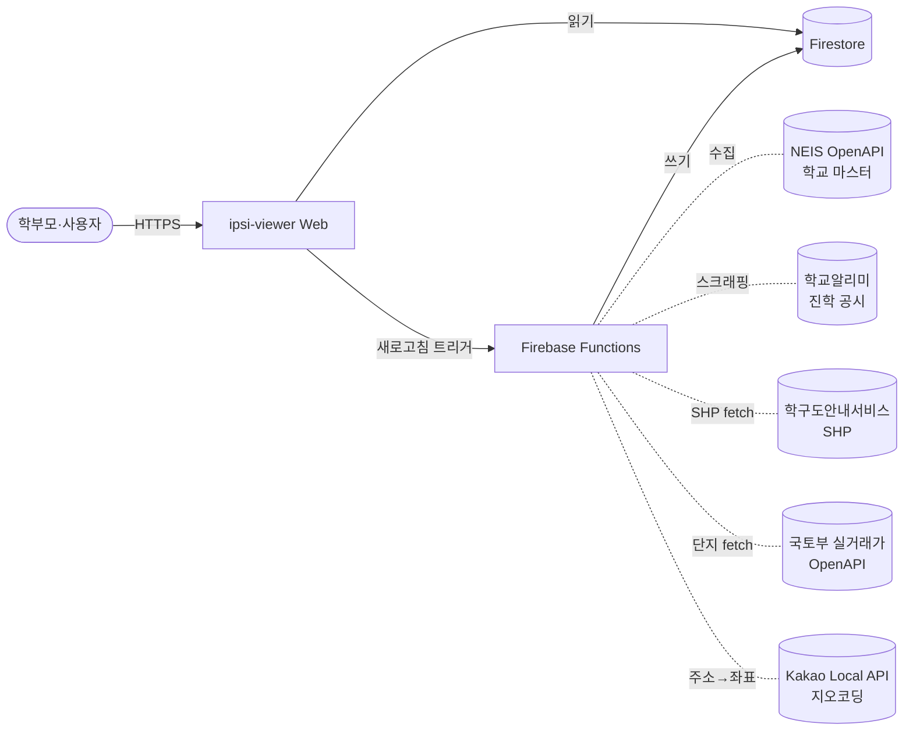
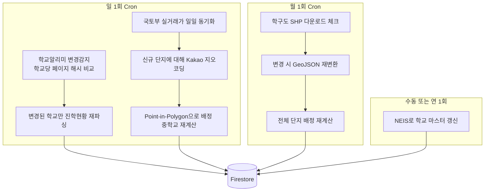
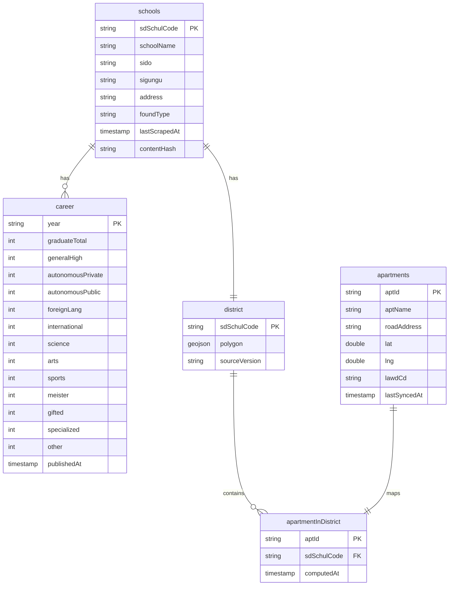
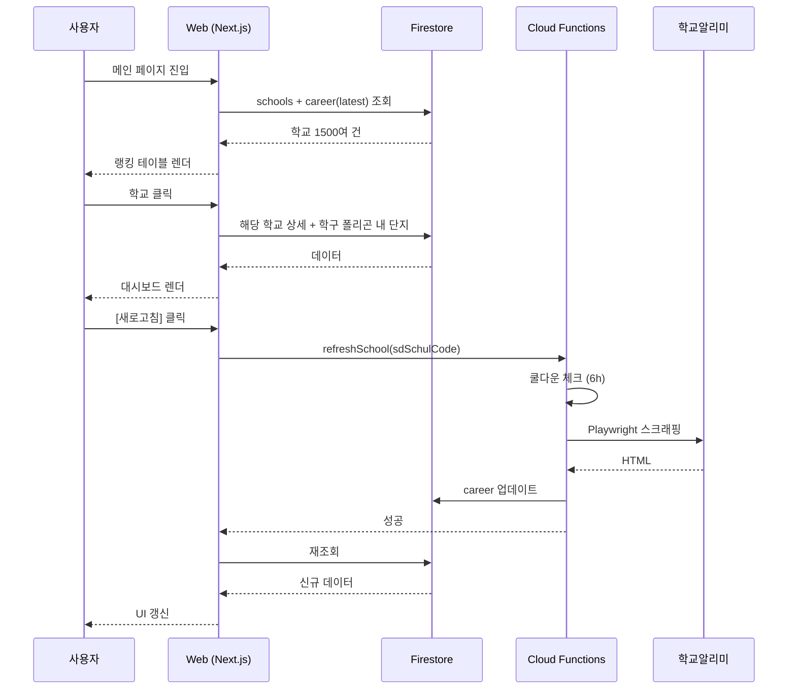

# 02. 아키텍처

## 1. 시스템 컨텍스트

## 2. 데이터 파이프라인

## 3. Firestore 데이터 모델

## 4. 사용자 인터랙션

## 5. 컴포넌트 책임

| 컴포넌트 | 책임 |
|---|---|
| `scripts/` (PoC) | 수집·변환 로직의 단독 실행 가능한 프로토타입 |
| `functions/` | 위 PoC를 Cloud Functions로 옮긴 운영 코드, Cloud Scheduler로 정기 실행 |
| `web/` | Next.js 클라이언트 — Firestore SDK 직접 사용, Cloud Functions는 새로고침·관리용 |
| `data/` | 로컬 PoC 산출물 보관(gitignore) |
| `docs/` | 요구사항·아키텍처·운영 문서 |

## 6. 기술 선택 근거

- **TypeScript 일관**: scripts·functions·web 모두 동일 스택 → 도메인 타입 공유
- **Firestore over Cloud SQL**: 학교 1500개·단지 수만 개 수준에서 Firestore 무료 한도 내 충분, 스키마 진화 자유
- **Playwright over Cheerio/HTTP**: 학교알리미가 JS 렌더링 SPA — 단순 HTTP 요청 불가
- **Firebase Hosting + Functions over Cloud Run**: 통합 배포·인증·관제. 트래픽 작아 Cloud Run의 분리 가치가 적음
- **Cloud Scheduler over GitHub Actions**: Firebase 콘솔에서 단일 관리, 인증 일원화

## 7. 외부 인터페이스 요약

| 외부 시스템 | 인증 | 호출 빈도 | 폴백 |
|---|---|---|---|
| NEIS schoolInfo | API Key (선택) | 연 1회 (학교 마스터) | 익명 호출 시 페이지당 5건 |
| 학교알리미 | 없음 (스크래핑) | 일 1회 변경감지 | 페이지 변경 시 셀렉터 보수 필요 |
| 학구도(schoolzone.emac.kr) | 없음 (파일 DL) | 월 1회 체크 | 수동 다운로드 fallback |
| 국토부 실거래가 | 공공데이터포털 키 | 일 1회 | 익일 재시도 |
| Kakao Local | REST Key | 단지 신규 시만 | 일 30만 호출 한도 내 |
